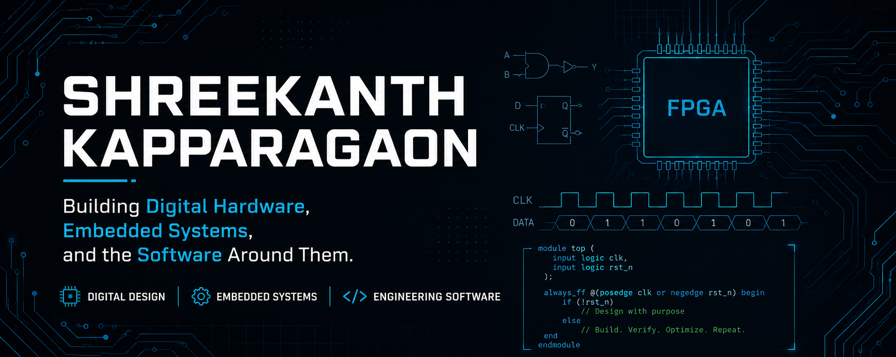

  

  

  
  
  

---
 

# About

I'm an **Electronics & Communication Engineer** passionate about designing **Digital Hardware**, developing **Embedded Systems**, and building **Engineering Software** that bridges hardware and software.

My current goal is to build a high-quality **open-source RTL IP library**, engineering tools, and embedded projects while continuously expanding my expertise in **Digital Design, Embedded Systems,** and **Engineering Software**.

 

---

<h2 align="center">⚡ Engineering Focus</h2>

Building reliable hardware and the software that supports it.

 

<table>
<tr>

<td width="50%" valign="top" align="center">

### ⚡ Digital Design

Designing reusable RTL IPs using **Verilog HDL**.

**Focus**

`RTL Design` • `FSM` • `Protocols` • `Verification`

</td>

<td width="50%" valign="top" align="center">

### 🔧 Embedded Systems

Developing firmware for modern embedded platforms.

**Focus**

`ESP32` • `STM32` • `Arduino` • `Drivers`

</td>

</tr>

<tr>

<td width="50%" valign="top" align="center">

### 🐍 Engineering Software

Building tools that improve engineering productivity.

**Focus**

`Python` • `Automation` • `CLI` • `GUI`

</td>

<td width="50%" valign="top" align="center">

### 🌐 Backend Development

Creating scalable backend applications and APIs.

**Focus**

`Django` • `Flask` • `REST APIs` • `Databases`

</td>

</tr>

</table>

 

---

<h2 align="center">🚀 Featured Projects</h2>

A selection of projects that showcase my work in Digital Design,
Embedded Systems, and Engineering Software.

 

<table>

<tr>

<td width="50%" valign="top">

### 🧩 VeriSketch

**Verilog Visualization Tool**

A Python-based tool for parsing Verilog HDL and generating architecture and RTL visualizations.

**Tech Stack**

`Python` `Verilog` `CLI`

<a href="https://github.com/shreekanthkapparagaon/verisketch">
View Repository →
</a>

</td>

<td width="50%" valign="top">

### 📡 I²C Master Controller

**Parameterized RTL IP**

A synthesizable Verilog implementation of the I²C protocol with simulation and verification.

**Tech Stack**

`Verilog` `FSM` `GTKWave`

<a href="https://github.com/shreekanthkapparagaon/i2c-master-controller">
View Repository →
</a>

</td>

</tr>

<tr>

<td width="50%" valign="top">

### 🚌 APB3 Slave Peripheral

**AMBA APB3 Peripheral**

A configurable APB3 slave featuring a register bank, complete verification, and documentation.

**Tech Stack**

`Verilog` `AMBA APB3`

<a href="https://github.com/shreekanthkapparagaon/apb3-slave-peripheral">
View Repository →
</a>

</td>

<td width="50%" valign="top">

### 📚 Smart LMS

**Library Management System**

A web-based library management system for managing books, members, borrowing, and returns.

**Tech Stack**

`Python` `Django` `SQLite`

<a href="https://github.com/shreekanthkapparagaon/smart-lms">
View Repository →
</a>

</td>

</tr>

</table>

 

---
 

<h2 align="center">🎯 Current Focus</h2>

Continuously improving my skills through hands-on projects and open-source development.

 

- ⚡ Building a reusable **RTL IP Library** using Verilog HDL
- 🧩 Developing **VeriSketch**, a Verilog visualization and analysis tool
- 🔬 Exploring **RTL Verification** and **SystemVerilog**
- 🔧 Expanding my **Embedded Systems** portfolio with ESP32 and STM32
- 🐍 Creating Python tools that simplify engineering workflows

---
 

A quick overview of my GitHub activity and primary languages.

<h2 align="center">📊 GitHub Insights</h2>

---
 

### Thanks for visiting!

**Building Digital Hardware.**  
**Embedded Systems.**  
**Engineering Software.**

 

Always learning. Always building.

